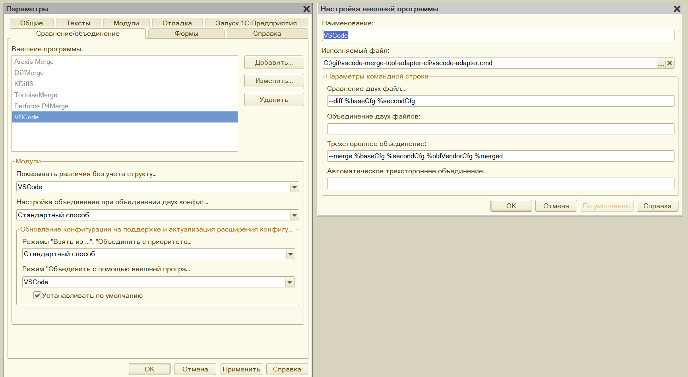
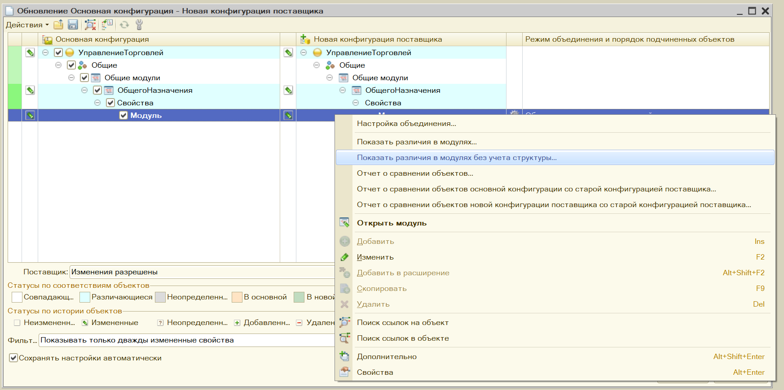
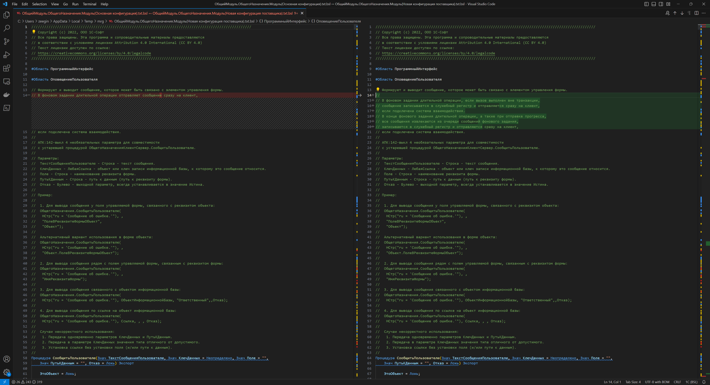
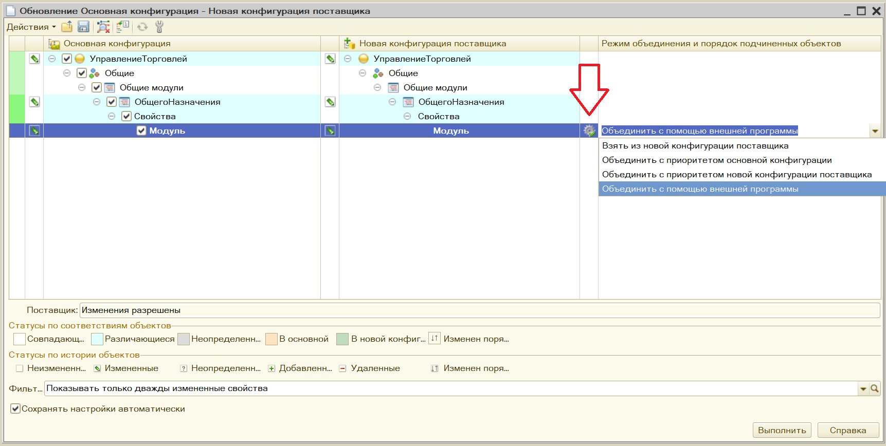
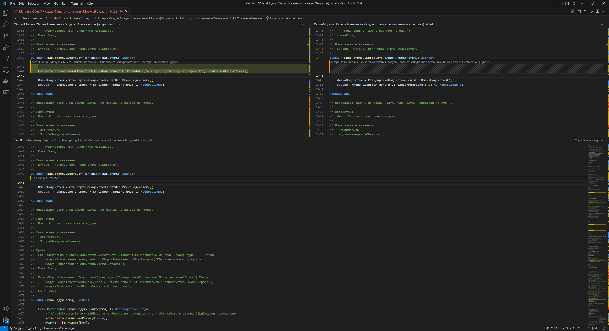
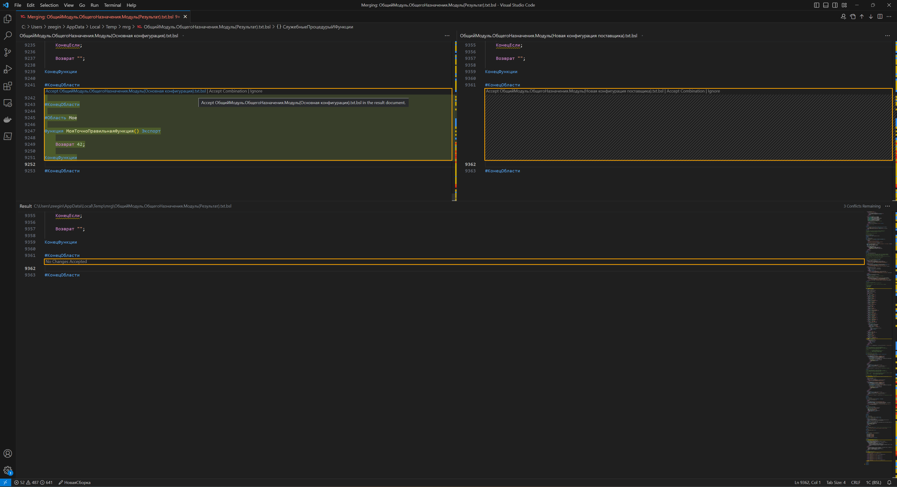

# Утилита которая дружит vscode и 1С:Предприятие

### Что надо знать:

#### Про Visual Studio Code
1. [Что такое vscode и где его взять](https://code.visualstudio.com/)
2. [three-way merge](https://code.visualstudio.com/updates/v1_70#_command-line-option-merge)
3. [Command Line Interface (CLI)](https://code.visualstudio.com/docs/editor/command-line)

#### Про поставку конфигураций 1С
1. [Поставка и поддержка конфигурации](https://its.1c.ru/db/v8323doc#bookmark:dev:TI000001137)
2. [Настройки внешних программ для операций сравнения/объединения](https://its.1c.ru/db/v8323doc#bookmark:dev:TI000001471)


### VSCode CLI

`--diff <file1> <file2>` - Open a file difference editor. Requires two file paths as arguments.

`--merge <path1> <path2> <base> <result>` - Perform a three-way merge by providing paths for two modified versions of a file, the common origin of both modified versions, and the output file to save merge results.

`--wait` - Wait for the files to be closed before returning.

`--new-window` - Opens a new session of VS Code instead of restoring the previous session (default).

`--sync <on | off>` - Turn sync on or off.

### Perforce P4Merge конфигурация для 1С:Предприятия

Compare two files:
```cmd
-C utf8-bom -nl %baseCfgTitle -nr %secondCfgTitle %baseCfg %secondCfg
```

Three-way merge:
```cmd
-C utf8-bom -nl %baseCfgTitle -nr %secondCfgTitle -nb %oldVendorCfgTitle %oldVendorCfg %baseCfg %secondCfg %merged
```

По функциональности похоже на `vscode`. Используем этот шаблон для составления утилиты которая будет запускать `vscode`.


### VSCode

Compare two files:
```cmd
--diff %baseCfg %secondCfg --new-window --sync off
```

Three-way merge:
```cmd
--merge %baseCfg %secondCfg %oldVendorCfg %merged --new-window --sync off --wait
```


### Особенности

Платформа кидает пути со смешанными слешами, например такие:
```
"C:\Users\zeegin\AppData\Local\Temp\mrg/CommonModule.DistributedModule.Module(File C__Users_zeegin_Downloads_1Cv8_1.0.2.cf).txt"
```

Пути в файлах кидаются с расширением `.txt` а чтобы в `vscode` работала подсветка должны быть `.bsl`.
Потому надо обернуть в создание файлов `.bsl` копированием.

Платформа ожидает результат в `%merged`, однако сам файл не создает. `vscode` хочет чтобы в `--merge ... <result>` файл уже был.
Потому надо файл создать, например копированием `%secondCfg`, а после завершения работы `vscode` уже кинуть в путь, который ожидает платформа.

У батч скриптов есть два варианта получения параметров коммандной строки:
- `%1` - получает параметр по индексу `1` включая кавычки `"` если они есть.
- `%~1` - получает параметр по индексу `1` исключая кавычки `"` если они есть.

Обычная команда `copy` плохо работает с путями со смешанными слешами, потому лучше использовать `xcopy`.

### Как использовать:
1. При установке `vscode` выбирите пункт добавление программы в `PATH`, тогда ее можно открывать командой консоли `code`.
2. Выбирите в конфигураторе `Сервис` -> `Параметры` -> `Сравнение/Объединение` -> `Создать`.
3. Переименуйте в `VSCode`.
4. Впишите исполняемый файл полный путь до `vscode-adapter.cmd`, например `C:\git\vscode-merge-tool-adapter-cli\vscode-adapter.cmd`.
5. Введите команду для сравнения двух файлов:
    ```
   --diff %baseCfg %secondCfg
    ```
6. Введите команду для трехстороннего объединения:
   ```
   --merge %baseCfg %secondCfg %oldVendorCfg %merged
   ```
7. Выберите `VSCode` в качестве редактора.
   - Показывать различия без учета структуры.
   - Режим `Объединить с помощью внешней программы`.

### Скриншоты







